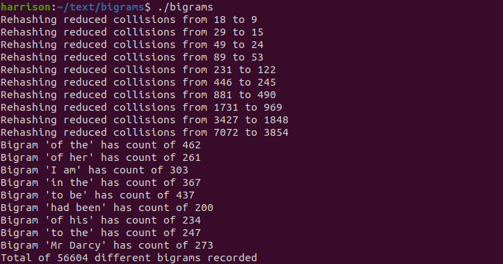

# Text Analysis Programming Challenges

(NOTE: Course and instructor name omitted at his request, likely to prevent future students from finding and referencing this repository for solutions)

These programs all involve reading, handling, and manipulating strings.

## *bigrams*
Takes in a .txt file (in our case, Jane Austen's *Pride and Prejudice*) and generates a dictionary of all the bigrams (two-word combinations) in the text and their number of occurrences.
- Dynamic memory allocation and Fx Hash (32-bit) is used to create the hash table
- When more than half of the table is filled, the table doubles in size in order to avoid excess collisions, then prints the collisions for the previous and newly expanded tables for comparison
- Upon completing, the program prints all bigrams with at least 200 occurrences. If none reach 200, it prints all bigrams. Lastly, it print out the total number of bigrams

## *cryptogram*
Acts as a coding/decoding program that takes a password and scrambles (or unscrambles) a string of characters.
- Three inputs:
  - "encrypt" or "decrypt" command
  - Password used to encrypt/decrypt string
  - Character string to be encrypted/decrypted
- Letters in the password indicate the change that should be applied to the corresponding letters in the string during encryption, i.e. ``'a'`` shifts by ``0``, ``'b'`` shifts by ``1``, ``'z'`` shifts by ``25``, etc. Ignores all non-alphabetic characters
- The case (upper or lower) of each letter in the string is preserved, non-alphabetic characters are skipped over, and the password is looped through until the end of the string is reached
- Decryption follows similar guidelines, but in the reverse direction

## *spellcheck*
Uses a ternary search tree to list out suggested spelling corrections given an input word. Accounts for insertion, deletion, replacement, and transposition errors.

